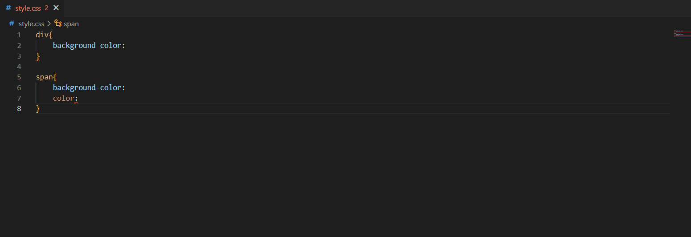

## Features

Select a color using the color picker widget, and insert it into the current editor or copy it to the clipboard.

>Inserting a color from the command palette as a Color3

 
A color can be inserted at multiple selected positions, or replace selected text. This is for your Rojo projects where you can customize your game element colors using vscode.
 
The window can also be opened from the context menu in the editor.

 

> Color picker widget based on <a href="https://github.com/mdbassit/Coloris">Coloris</a>
> Extension Main Frame: <a href="https://github.com/djlynn03/insert-color">insert-color</a>

## Release Notes

### 0.0.2

Initial release of Insert Color for luau